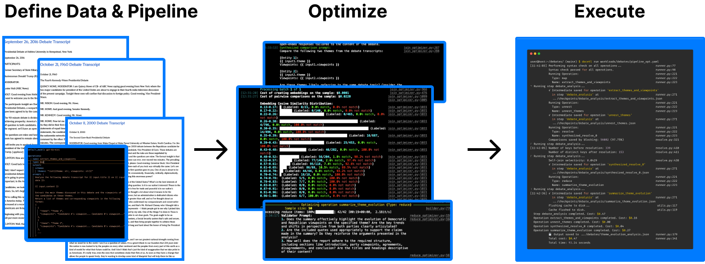

# DocETL: Powering Complex Document Processing Pipelines

[](https://docetl.org)
[](https://ucbepic.github.io/docetl)
[](https://discord.gg/fHp7B2X3xx)
[](https://arxiv.org/abs/2410.12189)



DocETL is a tool for creating and executing data processing pipelines, especially suited for complex document processing tasks. It offers a low-code, declarative YAML interface to define LLM-powered operations on complex data.

## When to Use DocETL

DocETL is the ideal choice when you're looking to maximize correctness and output quality for complex tasks over a collection of documents or unstructured datasets. You should consider using DocETL if:

- You want to perform semantic processing on a collection of data
- You have complex tasks that you want to represent via map-reduce
- You're unsure how to best express your task to maximize LLM accuracy
- You're working with long documents that don't fit into a single prompt
- You have validation criteria and want tasks to automatically retry when validation fails

## Community Projects

- [Conversation Generator](https://github.com/PassionFruits-net/docetl-conversation)
- [Text-to-speech](https://github.com/PassionFruits-net/docetl-speaker)
- [YouTube Transcript Topic Extraction](https://github.com/rajib76/docetl_examples)

## Educational Resources

- [UI/UX Thoughts](https://x.com/sh_reya/status/1846235904664273201)
- [Using Gleaning to Improve Output Quality](https://x.com/sh_reya/status/1843354256335876262)
- [Deep Dive on Resolve Operator](https://x.com/sh_reya/status/1840796824636121288)

## Installation

### Prerequisites

- Python 3.10 or later
- OpenAI API key

### Quick Start

1. Install from PyPI:
```bash
pip install docetl
```

### Running the UI Locally


1. Clone the repository:
```bash
git clone https://github.com/ucbepic/docetl.git
cd docetl
```

2. Install dependencies:
```bash
make install      # Install Python package
make install-ui   # Install UI dependencies
```

3. Set up environment variables in `.env`:
```bash
OPENAI_API_KEY=your_api_key_here
BACKEND_ALLOW_ORIGINS=
BACKEND_HOST=localhost
BACKEND_PORT=8000
BACKEND_RELOAD=True
FRONTEND_HOST=0.0.0.0
FRONTEND_PORT=3000
```

4. Start the development server:
```bash
make run-ui-dev
```

5. Visit http://localhost:3000/playground

### Development Setup

If you're planning to contribute or modify DocETL, you can verify your setup by running the test suite:

```bash
make tests-basic  # Runs basic test suite (costs < $0.01 with OpenAI)
```

For detailed documentation and tutorials, visit our [documentation](https://ucbepic.github.io/docetl).
